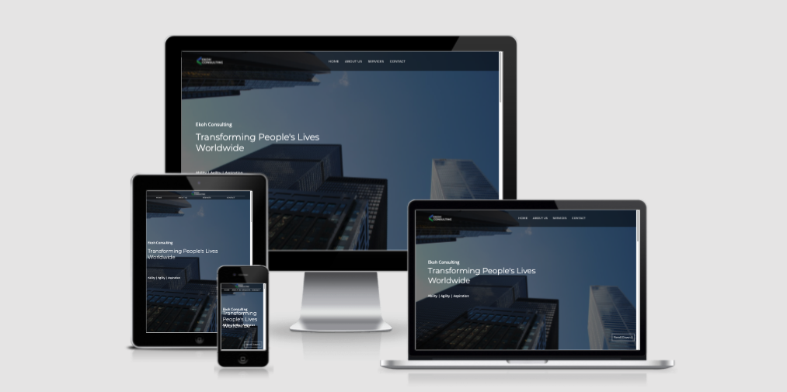
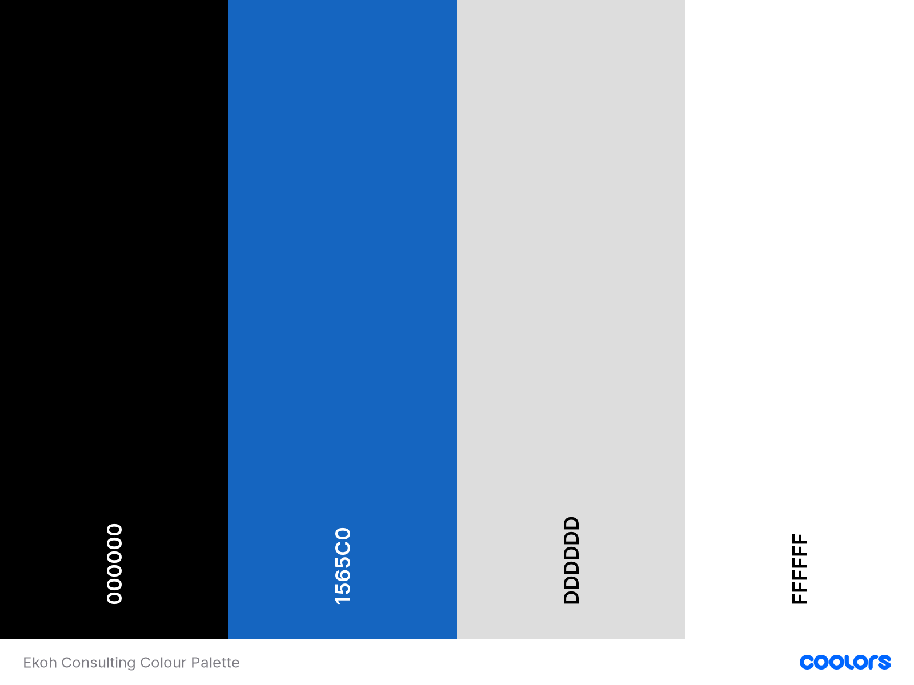
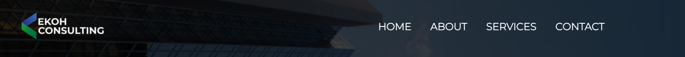
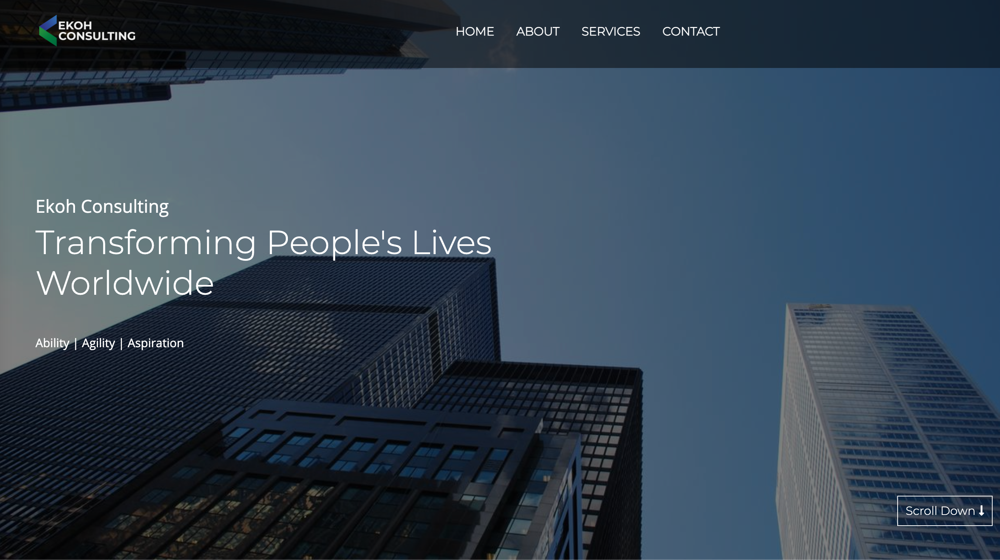
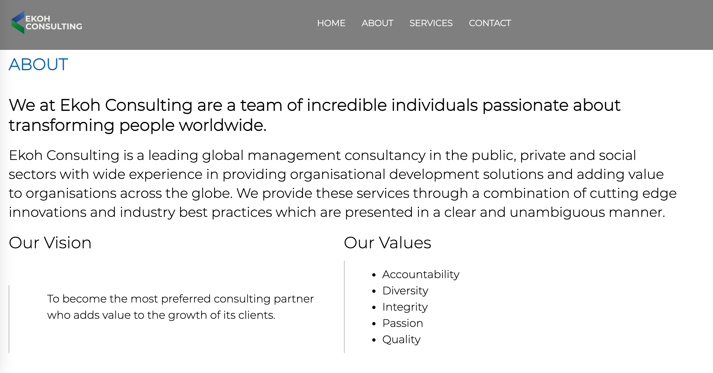
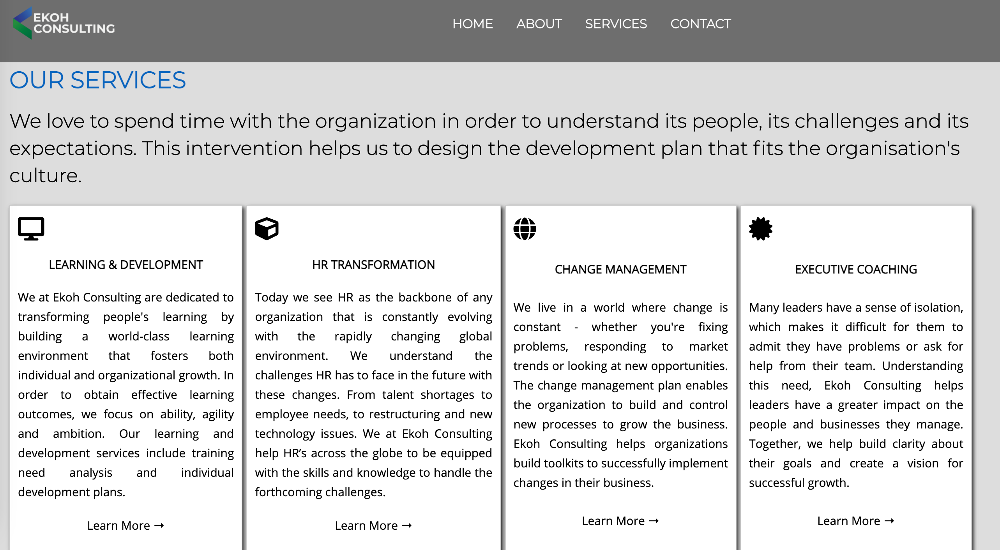
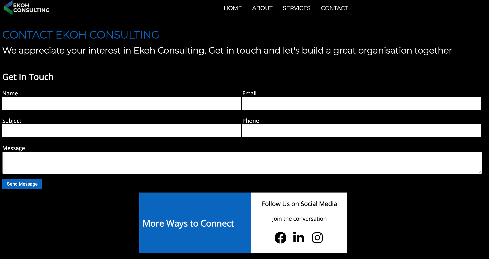
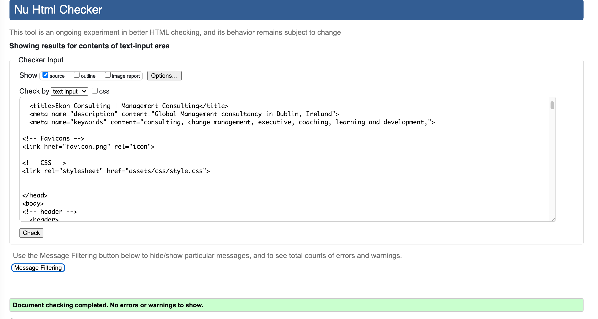
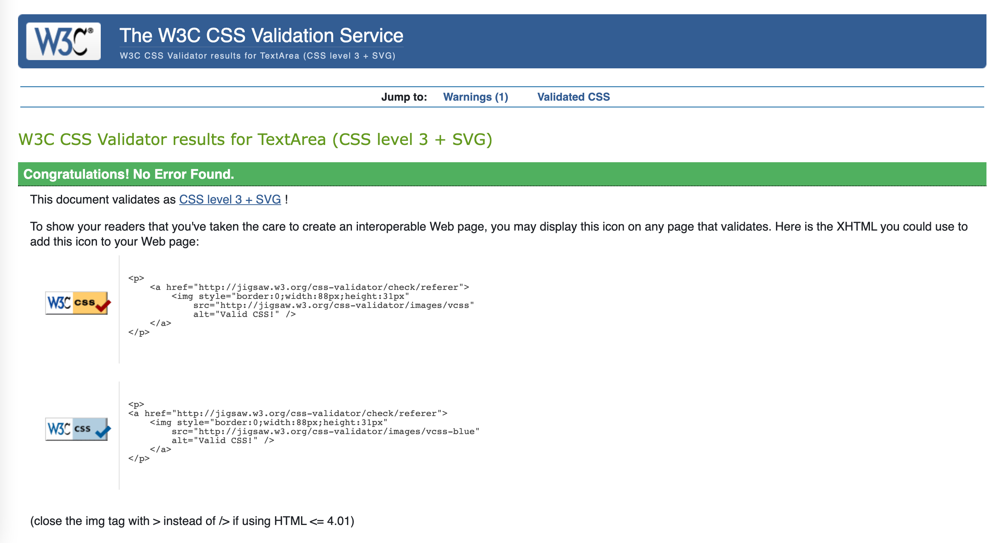

# Ekoh Consulting

[Ekoh Consulting](https://michaelekoh1.github.io/ekoh-consulting/index.html)

## Project Goals

Ekoh Consulting is a leading global management consultancy in the public, private and social sectors with wide experience in providing organisational development solutions and adding value to organisations across the globe.

We are a trusted advisor to many multinational organizations worldwide.

User Goals:

- Organisations can find information on the global management services that we provide.
- Helping clients achieve immediate impact on their businesses.

Site Owner Goal:

- Provide an interactive interface that users can navigate easily and quickly to find the information on the best and beneficial services we can provide to them.

*A screenshot of the Home page (index.html) is viewed on different screen sizes, generated by [ami.responsivedesign.is](http://ami.responsivedesign.is/). An interactive scrollable version is available [here](http://ami.responsivedesign.is/?url=https://michaelekoh1.github.io/ekoh-consulting/index.html).*

## UX

## User Stories

1. As a user, I would like to know more about the organization and its modus operandi from the about us page.
2. As a user, I would like to have a detailed understanding of the services and its applications the firm is providing.
3. As user, I want to be able to navigate through the contact page in order to get the location, email address, contact number and also social media links so that I can use the application to get in touch.

## Design

### Wireframes

Based on the above User Stories, the following wireframes were mocked up.

- [index.html](https://github.com/michaelekoh1/ekoh-consulting/blob/main/wireframes/index.pdf)
- [about.html](https://github.com/michaelekoh1/ekoh-consulting/blob/main/wireframes/aboutus.pdf)
- [services.html](https://github.com/michaelekoh1/ekoh-consulting/blob/main/wireframes/services.pdf)
- [contact.html](https://github.com/michaelekoh1/ekoh-consulting/blob/main/wireframes/contact.pdf)

### Colour Scheme

The site's colour scheme was built around the hero image.

## Features

In this section, we will see different parts of the project with a bit of description.

### Existing Features

- Navigaton Bar

  - The navigation bar is present on all the pages of the website.

  - The navigation bar is fixed on the top, however it has a smooth scroll.
  
  - On the mobile devices, the  navigation bar remains the same with the logo over it.

### Homepage Features

- The home page or the index page includes a photograph which covers the entire page with text and navigation bar overlaying it.

- The text on the home page gives a clear message to the user on what the organization is all about.

### Aboutpage Features

- The about page give a detailed explaination about the organization and their vision & values.

### Servicepage Features

- The service page will allow the user to go through all the servies the company is providing to its clients.

- For detailed understand about each of the services, the user can click on the learn more link to have a detailed explaination about each of the services.

### Contactpage Features

- This page will allow the user to contact us or stay intouch with the latest updates by navigating to the social media links.

- In the get in touch option, the user has to fill in his or her information and leave a message in case they have some questions to be addressed.

- Send Message is the visibale button at the end of the form that the user has to click in oerder to sent their message.

### Fonts

All fonts for the site are from [Google Fonts](https://fonts.google.com/).
- [Montserrat](https://fonts.google.com/specimen/Montserrat) is used for main headings and titles.
- [Open Sans](https://fonts.google.com/specimen/Open+Sans?query=Steve+Matteson#standard-styles) is used for sub-headings and for the body text.

## Technologies Used

- HTML5 - the pages of the website were designed using HTML.
- CSS3 -  the pages of the website were styled using CSS.
- [Gitpod](https://www.gitpod.io/) - the website was developed using Gitpod as the development environment.
- [Font Awesome](https://fontawesome.com/)- Font Awesome icons were used for the social media links on the contact page and in the services page.
- [Google Fonts](https://fonts.google.com/) Google Fonts were used throughout the project.
- [Favicon Generator](https://www.favicongenerator.com/)
- Favicon Generator was used to create and size the favicon for the site, using the logo created above.
- Photoshop(Adobe)- The logo was designed using Adobe Photoshop software.

# Validation 
- [W3C Markup Validation Service](https://validator.w3.org/#validate_by_input)

   **W3 HTML Validator Complete**
   

- [W3C CSS Validation Service](https://jigsaw.w3.org/css-validator/#validate_by_input)

   **CSS Validator Complete**
   

- [jshint.com](https://jshint.com/)

# Testing

- ### **Performace Testing**

[Performance Testing](assets/img/Testing/Lighthouse.png)

- ### **Device Testing**

For all my media queries, I used tutor support, and CSS **[A Complete Guide to CSS Media Queries](https://css-tricks.com/a-complete-guide-to-css-media-queries/)** in getting my site responsive for all devices

The website was tested on the following devices:

**Browser**
   - Dell XPS 

**Mobile**
   -iPhone 8 / 8 Plus / X / 12

**Tablet**
   -iPad
   -iPad Pro

- Dev Tools was used to test the responsiveness on other devices

### Automated Testing

- Each page of the site was evaluated using Lighthouse to assess them on four metrics; Performance, Accessibility, Best Practices & Search Engine Optimization (SEO).

# Deployment

The site was deployed to GitHub pages. The steps to deploy are as follows:

- In the GitHub repository, navigate to the Settings tab

- From the source section drop-down menu, select the Master Branch

- Once the master branch has been selected, the page will be automatically refreshed with a detailed ribbon display to indicate the successful deployment.

The live link can be found here: (https://michaelekoh1.github.io/ekoh-consulting/index.html)

# Credits

## Content

- Hero image was taken from pixabay website which was an Open Source site for personal use.

- Various instucttions like understanding the basics of a good website and simplicity of a webpage were taken from You Tube.

# Acknowledgement

I would like to take this opportunity to thank my mentor Jack Wachira for his great guidance in the accomplishment of this project and the whole learning experience.